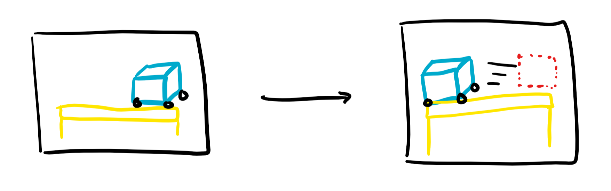
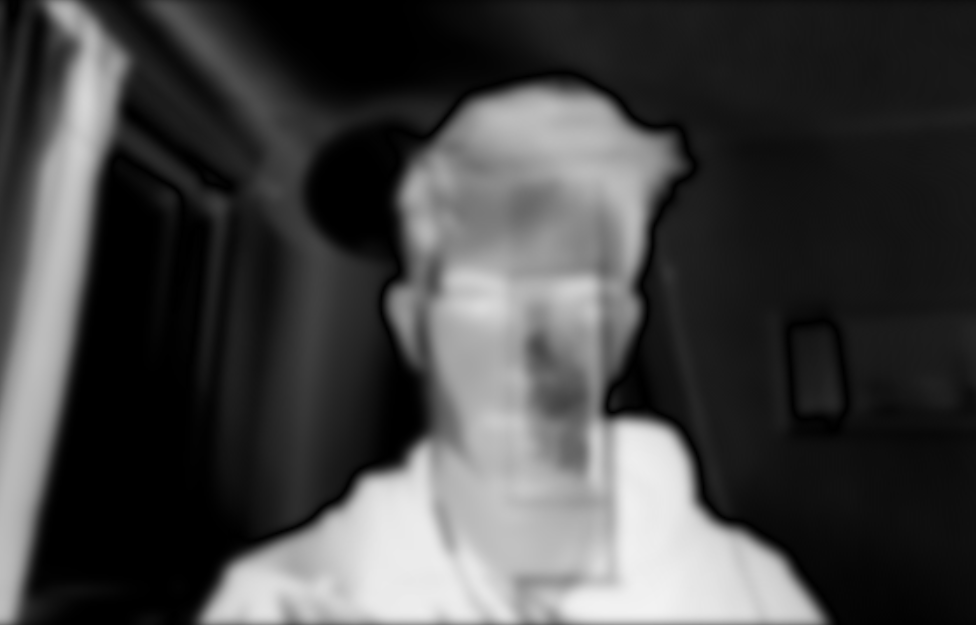
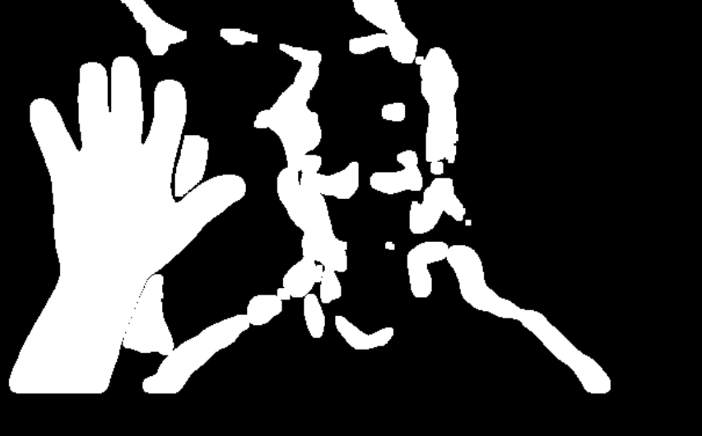

# Motion Detection

###### To Run

- Create / Download Script
- Run `pip install opencv-python  ` from a command line/terminal
- Run `python name_of_script.py`
- Type `q` at any point to quit video feed. 

###### Resources

- [Open CV](https://opencv-python-tutroals.readthedocs.io/en/latest/index.html)

###### Glossary

- **Contour**:  The location at which a steep slope, or a high gradient, exists between corresponding pixel values in an image.  (Can be used to differentiate objects which is useful for video processing for detection)
- **Edge**: A contour at a defined threshold value. (Often these terms are used interchangeably)

The primary methodology for motion detection is the comparison of pixel information between adjacent image stills within a video stream. To do so requires the capturing of frames from the webcam, the comparison of pixel information between frames to determine moving objects within contour boundaries, and some additional optimization and filtering to ensure that this process can proceed properly without irrelevant noise. 

------

### Building Frames

```python
import cv2

initial_frame = None
capture = cv2.VideoCapture(0)

while True: 
	state, current_frame = capture.read()
    gray = cv2.cvtColor(frame,cv2.COLOR_BGR2GRAY)
    gray = cv2.GaussianBlur(gray,(21,21),0)
    
    if initial_frame is None:
        initial_frame = gray
        continue
        
    delta = cv2.absdiff(initial_frame, gray)
    threshold = cv2.threshold(delta, 30, 255, cv2.THRESH_BINARY)[1]
    threshold = cv2.dilate(threshold, None, iterations=2)
    
    cv2.imshow("Gray", gray)
    cv2.imshow("Delta", delta)
    cv2.imshow("Threshold", threshold)
    
    key = cv2.waitKey(0)  
    
capture.release()
cv2.destroyAllWindows
    
```

### Starting a CV Capture 

To capture a video, you need to create a **VideoCapture** object.

To associate the default webcam with this object, pass the parameter 0. 

`capture = cv2.VideoCapture(0)`

With the object created, the current frame can be stored in a global variable. 

> `read()` is the most convenient method for reading video files or capturing data from decode and returning the just grabbed frame. It returns `=> retval, image`, where the image is the frame currently being read at a single timestep 

`capture.release()` is used to release the camera capture at the end of the script.

The additional information that RGB values provide is not necessary when detecting motion, so 

As we will be finding contours, we also need a low-pass filter, or image blur, prior to the processing steps due to the possibility of image noise creating flawed edge detection. This is because the contour calculation checks for high gradient pixel values at different locations, and smaller aspects of a visual image (such as freckles on a face) could be recognized as an independent image.


In this program, `imshow()` is used to show singular frames such as the now blurred and grayscaled image above

> To understand the various transformations you can apply on a frame, see [this](https://docs.opencv.org/2.4/modules/imgproc/doc/miscellaneous_transformations.html#cvtcolor) doc. 


```python
import cv2

initial_frame = None
capture = cv2.VideoCapture(0)

while True: 
	state, current_frame = video.read()
    gray = cv2.cvtColor(current_frame,cv2.COLOR_BGR2GRAY)
    gray = cv2.GaussianBlur(gray,(21,21),0)
    
    if initial_frame is None:
        initial_frame = gray
        continue
        
    delta = cv2.absdiff(initial_frame, gray)
    threshold = cv2.threshold(delta, 30, 255, cv2.THRESH_BINARY)[1]
    threshold = cv2.dilate(threshold, None, iterations=2)
    
    cv2.imshow("Gray", gray)
    cv2.imshow("Delta", delta)
    cv2.imshow("Threshold", threshold)
    
    key = cv2.waitKey(0)  
    
capture.release()
cv2.destroyAllWindows
    
```

### Processing Frames

The motion detection really occurs in two steps that are repeated in sequence. As a video is a chain of image stills, the core process in detection is the storage of a single frame and a comparison to an adjacent frame.  



> The first frame has defined pixel values which are stored, and any significant change amongst these pixel values are recognized and detected

In the above code, the if statement will not be executed on the second iteration which serves the purpose of storing this initial frame for later comparison against all subsequent frames (within `initial_frame`)

The processing occurs in *five* core steps. 

1. Creation of the delta frame, which is composed of the difference of pixel values between the current frame and the adjacent frame. 

   

2. Creation of a threshold frame from the delta frame which establishes a consistent boundary between the 'movement' pixels of the delta frame.

   

3. Establishment of contours searching on the simplistic threshold frame, and an area check within the contour boundaries to determine 'object' classification.

4. Output of a label at each timestep plotting the placement of relevant moving 'objects' established from the previous contour area check that was created from the initial and adjacent frame difference.

   

   There are some intermediate steps that are used to reduce noise such as the dilation of the threshold frame, but these are not relevant to the core aspects of the process. 

   The following code is used to proceed with steps 3 and 4, and uses the initial uncolored/blurred frame received to add the label at each timestep. 

   ```python
   (contours,_)=cv2.findContours(thresh_frame.copy(),cv2.RETR_EXTERNAL, cv2.CHAIN_APPROX_SIMPLE)
       for contour in contours:
           if cv2.contourArea(contour) < 15000:
               continue
   
           (x, y, w, h) = cv2.boundingRect(contour)
           cv2.rectangle(current_frame, (x, y), (x+w, y+h), (255,0,0), 2)
   ```

